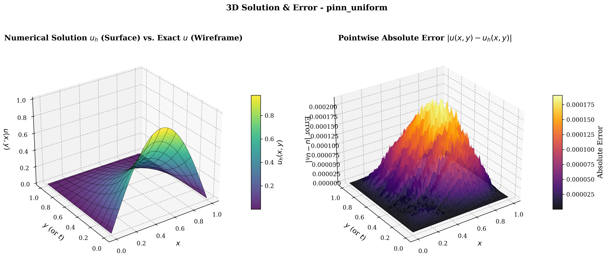
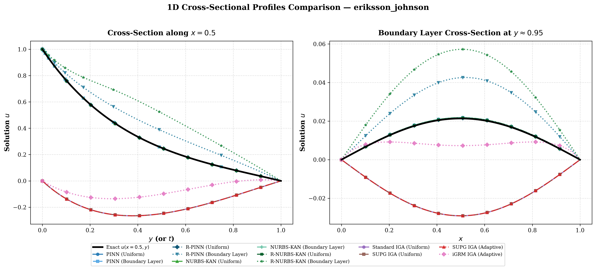
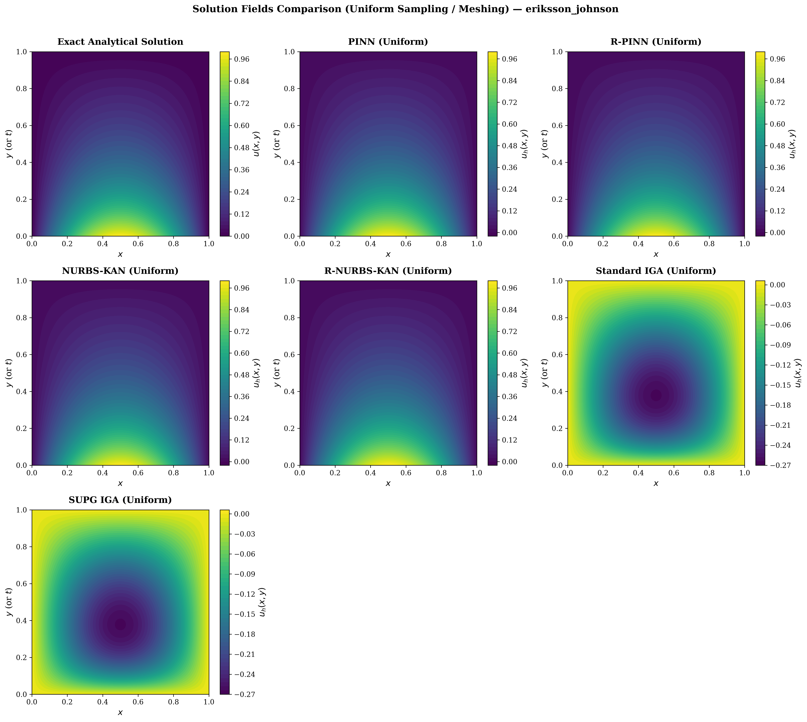
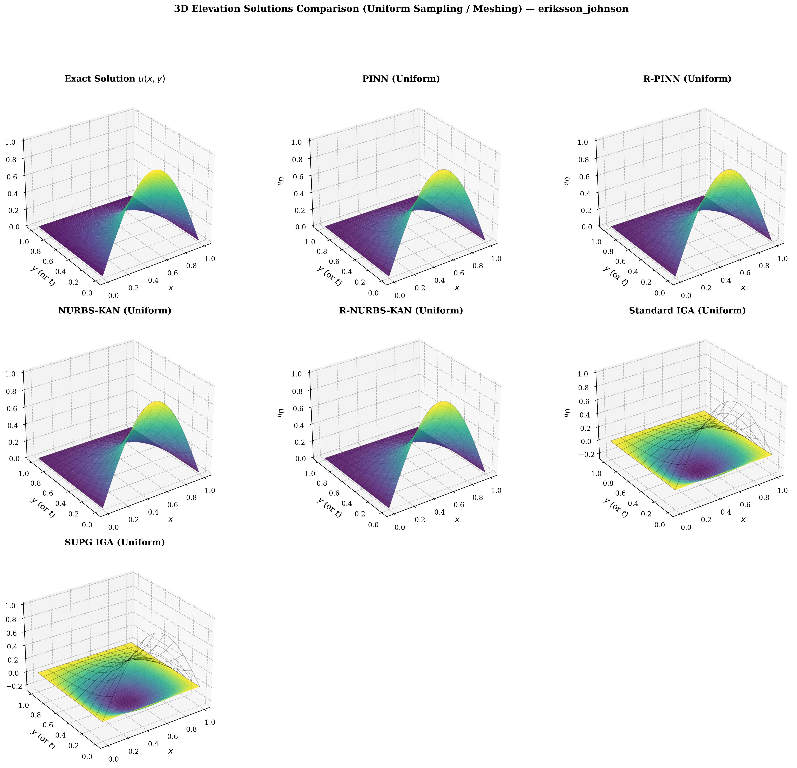
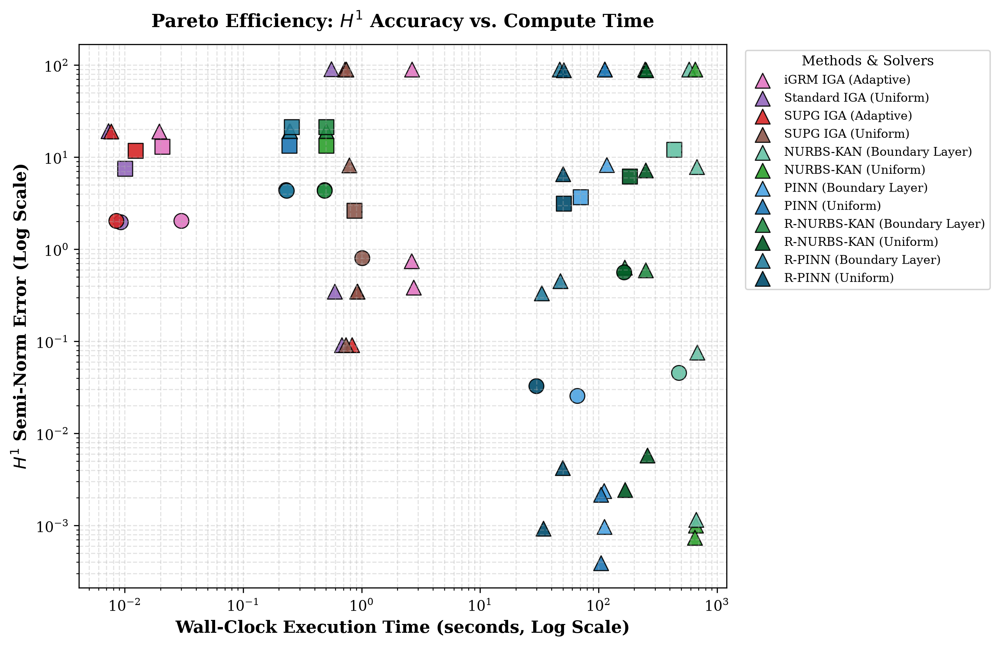
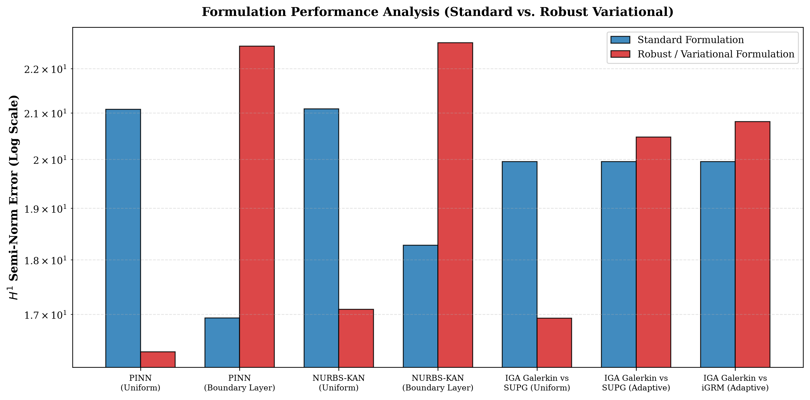
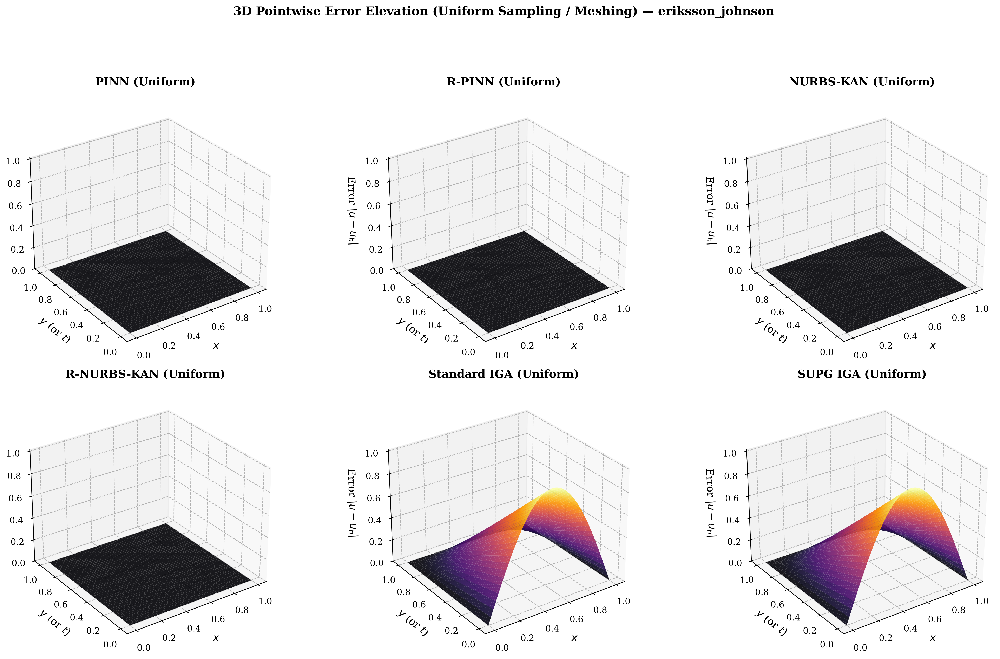
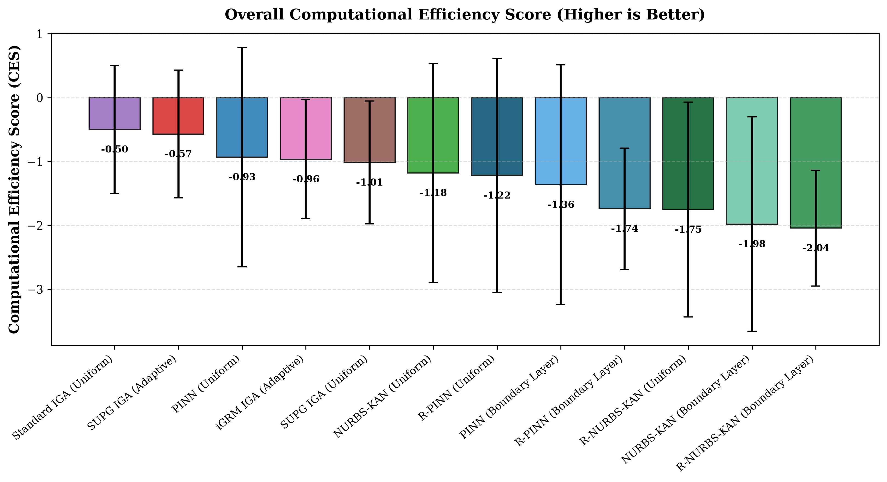

# Comparison of Kolmogorov-Arnold Neural Networks with Non-Uniform Rational B-Splines Trainable Activation Functions with Physics-Informed Neural Networks and Isogeometric Finite Element Method Solvers for Advection-Dominated Diffusion Problems

**Authors**: Maciej Sikora*¹, Maciej Paszyński¹, Anna Paszyńska²  
¹ *AGH University of Krakow, Poland*  
² *Jagiellonian University, Poland*  

> Supported by National Science Centre, Poland grant no. 2025/57/B/ST6/00058.

---

## Executive Summary

This repository hosts a unified, high-performance research platform for systematically benchmarking **Physics-Informed Neural Networks (PINN)**, **Kolmogorov-Arnold Networks with Rational B-Spline Activations (IGA-KANN / NURBS-KAN)**, and higher-order **Isogeometric Analysis Finite Element Method (IGA-FEM)** solvers across two-dimensional Poisson and **advection-dominated diffusion problems** (including the Eriksson–Johnson benchmark).

We investigate:
1. Standard strong-form collocation vs. **Robust Variational Petrov-Galerkin losses** utilizing inverse Gram operators ($G^{-1}$) that approximate the Riesz representative of the residual.
2. Uniform point collocation vs. **Boundary-Layer adaptive sampling & mesh refinement**.
3. Direct linear solves vs. iterative neural optimization under varying diffusion coefficients ($\epsilon \in [0.001, 1.0]$).
4. Multi-objective trade-offs evaluated via **Pareto Efficiency Frontiers** and a composite **Computational Efficiency Score (CES)**.

---

## 1. Visual Showcase & Benchmark Results

The figures below represent top-performing results generated by the framework (auto-synchronized via `python update_example_outputs.py`):

| 3D Elevation Solution & Pointwise Error | 1D Boundary Layer Slice Resolution |
|:---:|:---:|
|  |  |
| *3D numerical solution $u_h(x, y)$ vs. exact wireframe $u(x, y)$ and 3D absolute error ($H^1 = 3.91 \times 10^{-4}$)* | *Cross-sectional profile along $x=0.5$ and near the outflow singular boundary $y \approx 0.95$* |

| Multi-Panel 2D Solution Fields | Multi-Panel 3D Solution Elevations |
|:---:|:---:|
|  |  |
| *2D solution contours comparing all uniform models against the analytical exact solution* | *Synchronized 3D perspective elevations comparing numerical methods against the exact wireframe* |

| Pareto Efficiency: Accuracy vs. Wall-Clock Time | Formulation Performance Analysis (Standard vs. Robust) |
|:---:|:---:|
|  |  |
| *Pareto efficiency frontier ($H^1$ semi-norm error vs. execution runtime in seconds)* | *Ablation benchmark comparing standard strong-form loss vs. robust Gram variational formulation* |

| 3D Multi-Panel Pointwise Error Elevation | Overall Computational Efficiency Score (CES) Ranking |
|:---:|:---:|
|  |  |
| *Synchronized 3D pointwise absolute error elevations across all evaluated numerical methods* | *Overall solver ranking balancing precision ($H^1$), execution speed ($\sqrt{t}$), and model compactness ($\sqrt[4]{\text{DoFs}}$)* |

---

## 2. Environment Setup & Installation Guide

### 2.1 Python Environment
We recommend **Python 3.10** or **Python 3.11**. Create and activate an isolated virtual environment:

```powershell
# Windows (PowerShell)
python -m venv venv
.\venv\Scripts\activate

# Linux / macOS (Bash)
python3 -m venv venv
source venv/bin/activate
```

### 2.2 PyTorch Installation (CUDA vs. CPU)
> [!IMPORTANT]
> Do not rely on unconstrained `pip install torch` because it may default to a CPU wheel or a mismatched CUDA build. Follow the official installation instructions from [pytorch.org](https://pytorch.org/get-started/locally/).

```powershell
# For NVIDIA GPU with CUDA 12.1 (Recommended for fast PINN/KAN training):
pip install torch torchvision --index-url https://download.pytorch.org/whl/cu121

# For NVIDIA GPU with CUDA 11.8:
pip install torch torchvision --index-url https://download.pytorch.org/whl/cu118

# For CPU-only environments:
pip install torch torchvision --index-url https://download.pytorch.org/whl/cpu
```

### 2.3 Framework Dependencies
Install remaining scientific computing, finite element, and visualization dependencies:
```powershell
pip install -r requirements.txt
```

---

## 3. Mathematical & Theoretical Foundations

### 3.1 Advection-Dominated Diffusion & Governing Equations
We consider the steady-state two-dimensional linear advection-diffusion boundary value problem defined on the unit square domain $\Omega = (0, 1)^2$:

$$-\epsilon \Delta u + \mathbf{b} \cdot \nabla u + c u = f \quad \text{in } \Omega, \quad u = 0 \quad \text{on } \partial\Omega$$

where:
- $\epsilon > 0$ is the **diffusion coefficient**,
- $\mathbf{b} = (b_x, b_y)^T$ is the advection velocity vector,
- $c \ge 0$ is the reaction coefficient,
- $f \in L^2(\Omega)$ is the source forcing term.

When $\epsilon \ll 1$, the problem enters the **advection-dominated regime** characterized by a high Péclet number:
$$\text{Pe} = \frac{\|\mathbf{b}\| L}{2\epsilon} \gg 1$$
In this regime, standard numerical methods (Galerkin FEM and standard PINNs) suffer from unphysical, spurious node-to-node oscillations due to steep boundary layers of thickness $\mathcal{O}(\epsilon)$ at outflow boundaries. `[VERIFICATION NEEDED]`

#### Benchmark Problems:
1. **Poisson High-Frequency Sine**:
   $$-\epsilon \Delta u = f, \quad u_{\text{exact}}(x, y) = \sin(2\pi x)\sin(2\pi y)$$
2. **Poisson Exponential Gradient**:
   $$-\epsilon \Delta u = f, \quad u_{\text{exact}}(x, y) = \sin(2\pi x)\sin(2\pi y)\exp(\pi(x - 2y))$$
3. **Eriksson–Johnson Convection-Diffusion**:
   $$-\epsilon \Delta u + u_y = f, \quad \mathbf{b} = (0, 1)^T$$
   featuring an exponential boundary layer at $y \to 1$ with analytical exact series representation. `[VERIFICATION NEEDED]`

---

### 3.2 Physics-Informed Neural Networks (PINN) & Distance Pinning

Standard PINNs approximate the solution using a Multi-Layer Perceptron (MLP) $u_\theta(x, y)$ parameterized by weights $\theta$.

#### Exact Boundary Distance Pinning (Hard Constraints):
Rather than adding soft boundary penalty loss terms that create conflicting gradient dynamics, Dirichlet boundary conditions ($u = 0$ on $\partial\Omega$) are satisfied **exactly and unconditionally** via an analytical distance multiplier:

$$u_\theta(x, y) = D(x, y) \cdot \mathcal{N}_\theta(x, y)$$

where the distance function:
$$D(x, y) = x(1 - x)y(1 - y)$$
strictly vanishes ($D(x, y) \equiv 0$) on all four boundary segments $\{x=0, x=1, y=0, y=1\}$. The network is then trained by minimizing the strong-form residual loss over interior collocation points:

$$\mathcal{L}_{\text{interior}}(\theta) = \frac{1}{N} \sum_{i=1}^N \left| -\epsilon \Delta u_\theta(x_i, y_i) + \mathbf{b} \cdot \nabla u_\theta(x_i, y_i) + c u_\theta(x_i, y_i) - f(x_i, y_i) \right|^2$$

---

### 3.3 Robust Variational PINNs (R-PINN) `[VERIFICATION NEEDED - Ref: Rojas et al., CMAME 2024]`

Standard strong-form collocation losses fail to measure the true error norm when $\epsilon \ll 1$. Robust Variational PINNs formulate the learning problem in the dual Sobolev space $V^* = (H^1_0(\Omega))^*$.

The residual equation in variational form is given by:
$$\langle R(u_\theta), v \rangle = \int_\Omega f v \, dx - \int_\Omega \left( \epsilon \nabla u_\theta \cdot \nabla v + (\mathbf{b} \cdot \nabla u_\theta) v + c u_\theta v \right) dx \quad \forall v \in V$$

To compute the dual norm $\|R(u_\theta)\|_{V^*}$, a finite-dimensional test space $V_h = \text{span}\{\psi_1, \dots, \psi_M\}$ is chosen. The **Gram matrix** $G \in \mathbb{R}^{M \times M}$ representing the inner product on $V_h$ is assembled:
$$G_{jk} = (\psi_j, \psi_k)_V = \int_\Omega \left( \nabla \psi_j \cdot \nabla \psi_k + \psi_j \psi_k \right) dx$$

The robust loss is formulated as:
$$\mathcal{L}_{\text{robust}}(\theta) = \mathbf{r}(u_\theta)^T G^{-1} \mathbf{r}(u_\theta)$$
where $\mathbf{r}_j(u_\theta) = \langle R(u_\theta), \psi_j \rangle$. This loss computes the discrete Riesz representative of the residual, directly bounding the true error in the energy norm.

---

### 3.4 Kolmogorov-Arnold Networks with Rational B-Splines (IGA-KANN / NURBS-KAN) `[VERIFICATION NEEDED - Ref: Liu et al., ICLR 2025]`

Kolmogorov-Arnold Networks (KAN) replace fixed activation functions on nodes with **learnable 1D univariate spline functions** $\phi_{i, j}(x)$ along network edges:

$$u(x_1, \dots, x_n) = \sum_{q=1}^{2n+1} \Phi_q \left( \sum_{p=1}^n \phi_{q, p}(x_p) \right)$$

In **IGA-KANN (NURBS-KAN)**, each edge activation function is parameterized by Non-Uniform Rational B-Splines (NURBS):
$$\phi(x) = w_b b(x) + w_s \sum_{i=1}^K c_i R_{i, p}(x)$$
where $R_{i, p}(x) = \frac{N_{i, p}(x) w_i}{\sum_j N_{j, p}(x) w_j}$ are rational basis functions with learnable control weights $c_i$ and projective weights $w_i$. Rational splines provide superior local gradient resolution without global Runge or Gibbs oscillations.

---

### 3.5 Robust Kolmogorov-Arnold Networks (R-NURBS-KAN)
R-NURBS-KAN combines the rational spline edge parameterization of KANs with the Petrov-Galerkin dual-norm inverse Gram loss operator $G^{-1}$, delivering superior stability on advection-dominated boundary layers.

---

### 3.6 Isogeometric Analysis Solvers (IGA-FEM) `[VERIFICATION NEEDED - Ref: Calo et al., CMAME 2021]`

Isogeometric Analysis (IGA) employs high-order, high-continuity B-spline basis functions $N_{i, p}(x) N_{j, p}(y)$ as both geometry and discrete approximation spaces:

1. **Standard Galerkin IGA**: Classical weak form $\int_\Omega (\epsilon \nabla u_h \cdot \nabla v_h + (\mathbf{b} \cdot \nabla u_h) v_h) dx = \int_\Omega f v_h dx$.
2. **Streamline-Upwind Petrov-Galerkin (SUPG)**: Residual-based stabilization adding diffusion along flow streamlines:
   $$\text{SUPG Term} = \sum_e \int_{\Omega_e} \left( -\epsilon \Delta u_h + \mathbf{b} \cdot \nabla u_h - f \right) \tau (\mathbf{b} \cdot \nabla v_h) dx$$
3. **Isogeometric Residual Minimization (iGRM)**: Dual-norm residual minimization with enriched test spaces ($p_v = p_u + 1$) and direction-splitting preconditioning.

> [!NOTE]
> **Why IGA Error is a Single Direct Floor vs. Neural Epoch Convergence**
> - **PINN & KAN** are iterative neural networks optimized via gradient descent across $N_{\text{epochs}}$, recording an evolving convergence trajectory.
> - **IGA-FEM** solves a direct sparse linear system ($K\mathbf{u} = \mathbf{F}$) in a single computational step ($\sim 0.03\text{s}$). The resulting error represents the exact best approximation in the discrete B-spline space $V_h$, acting as a permanent accuracy floor that cannot improve further without mesh refinement ($h$-refinement) or spline degree elevation ($p$-enrichment).

---

## 4. Evaluation Metrics & Pareto Efficiency

### 4.1 Numerical Error Norms
Evaluated on ultra-fine evaluation meshes ($N_x \times N_y = 100 \times 100$):
- **Sobolev $H^1$ Semi-Norm Error**:
  $$|u - u_h|_{H^1(\Omega)} = \left( \int_\Omega \left( \left|\frac{\partial u}{\partial x} - \frac{\partial u_h}{\partial x}\right|^2 + \left|\frac{\partial u}{\partial y} - \frac{\partial u_h}{\partial y}\right|^2 \right) dx \, dy \right)^{1/2}$$
- **$L^2$ Norm Error**: $\|u - u_h\|_{L^2(\Omega)} = \left( \int_\Omega |u - u_h|^2 dx \, dy \right)^{1/2}$
- **Maximum Pointwise Error ($L^\infty$)**: $\|u - u_h\|_{L^\infty(\Omega)} = \max_{(x, y) \in \Omega} |u(x, y) - u_h(x, y)|$

### 4.2 Computational Efficiency Score (CES)
$$\text{CES} = -\log_{10}\left( H^1_{\text{error}} \cdot \sqrt{\text{Elapsed Time (s)}} \cdot \sqrt[4]{\text{DoFs or Params}} \right)$$

- **Higher Score is Better**: Higher index reflects superior accuracy per unit of execution runtime and parameter footprint.
- **Accuracy Term ($H^1_{\text{error}}$)**: Primary objective; lower error boosts the score.
- **Time Penalty ($\sqrt{\text{Time}}$)**: Sublinear penalty for wall-clock training/solving duration.
- **Representation Penalty ($\sqrt[4]{\text{DoFs}}$)**: Fourth-root penalty for memory footprint and parameter count.

---

## 5. Visual Standards & Color Palette Guide

| Method Family | Formulation | Mesh / Collocation | Color Hex | Line Style | Marker |
|---|---|---|---|---|---|
| **PINN Family** | Standard | Uniform | `#1f77b4` (Classic Blue) | Solid (`-`) | Circle (`o`) |
| **PINN Family** | Standard | Boundary Layer | `#4ba3e3` (Light Blue) | Dashed (`--`) | Square (`s`) |
| **PINN Family** | Robust (R-PINN) | Uniform | `#004c6d` (Navy Blue) | Dash-dot (`-.`) | Diamond (`D`) |
| **PINN Family** | Robust (R-PINN) | Boundary Layer | `#257d9d` (Medium Navy) | Dotted (`:`) | Triangle Down (`v`) |
| **KAN Family** | Standard NURBS-KAN | Uniform | `#2ca02c` (Medium Green) | Solid (`-`) | Triangle Up (`^`) |
| **KAN Family** | Standard NURBS-KAN | Boundary Layer | `#66c2a5` (Mint Green) | Dashed (`--`) | Plus (`P`) |
| **KAN Family** | Robust R-NURBS-KAN | Uniform | `#005a24` (Forest Green) | Dash-dot (`-.`) | Cross (`X`) |
| **KAN Family** | Robust R-NURBS-KAN | Boundary Layer | `#238b45` (Emerald Green) | Dotted (`:`) | Star (`*`) |
| **IGA Family** | Standard Galerkin | Uniform | `#9467bd` (Purple) | Solid (`-`) | Circle (`o`) |
| **IGA Family** | SUPG Stabilized | Uniform | `#8c564b` (Brown) | Dashed (`--`) | Square (`s`) |
| **IGA Family** | SUPG Stabilized | Adaptive Mesh | `#d62728` (Crimson Red) | Dash-dot (`-.`) | Triangle Up (`^`) |
| **IGA Family** | iGRM Minimization | Adaptive Mesh | `#e377c2` (Magenta Pink) | Dotted (`:`) | Diamond (`D`) |

---

## 6. Framework Architecture & Directory Layout

```
.
├── sweeps/
│   ├── benchmark_matrix.yaml     # 72-run benchmark sweep (6 problems x 12 methods)
│   └── test_matrix.yaml          # Smoke-test sweep (3 problems x 7 methods)
├── training_config/              # Declaratively compiled YAML configs
├── src/
│   ├── problems/                 # PDEProblem strategies (Sine, Exp, Eriksson-Johnson)
│   ├── samplers/                 # Uniform, boundary-layer, and adaptive coordinate samplers
│   ├── solvers/
│   │   ├── pinn/                 # PINN & R-PINN implementations
│   │   ├── kan/                  # NURBS-KAN & R-NURBS-KAN implementations
│   │   └── iga/                  # Galerkin, SUPG, and iGRM IGA implementations
│   └── visualization/            # Standalone, decoupled plotting modules
├── manage_configs.py             # Config compiler
├── train.py                      # Single-method training runner (compute only)
├── plot_run.py                   # Per-run parallel diagnostic visualizer (6 plots)
├── plot_problem_comparisons.py   # Problem-level comparison aggregator (2D/3D grids, 1D slices, tables)
├── plot_comparison_suite.py      # Global multi-problem Pareto & synthesis suite
├── regenerate_all_plots.py       # High-performance parallel plot regenerator
├── update_example_outputs.py     # Syncs top results to example_outputs/ for README
├── run_all.py                    # Master benchmark orchestrator
├── example_outputs/              # Showcase gallery assets for documentation
└── output/                       # Benchmark artifacts directory
    ├── <problem_id>/
    │   ├── <method_name>/        # Raw outcomes.npz, metadata.yaml, model checkpoint, 6 diagnostic plots
    │   └── comparisons/          # Problem-level summary tables, 1D slices, separated 2D/3D grids
    └── global_comparisons/       # Pareto curves, CES ranking, formulation analysis, global synthesis table
```

---

## 7. How to Use & Reproduce Benchmarks

### 7.1 Compile Configurations
```powershell
python manage_configs.py sweeps/benchmark_matrix.yaml
python manage_configs.py sweeps/test_matrix.yaml
```

### 7.2 Run Single Method & Diagnostics
```powershell
# 1. Train single method (compute only)
python train.py --config training_config/eriksson_johnson_eps0.001/iga_supg_adaptive.yaml

# 2. Generate 6 diagnostic plots (loss, h1, prediction, error, 1D slices, 3D surface)
python plot_run.py --output-dir output/eriksson_johnson_eps0.001/iga_supg_adaptive

# 3. Generate problem-level comparisons
python plot_problem_comparisons.py --problem-dir output/eriksson_johnson_eps0.001

# 4. Generate global Pareto & synthesis suite
python plot_comparison_suite.py --output-dir output
```

### 7.3 Master Orchestrator (`run_all.py`)
```powershell
# Run smoke test (routes strictly to output/test_runs/ preserving production benchmarks)
python run_all.py --test

# Run full 72-configuration benchmark matrix with GPU sequential stream + CPU parallel workers
python run_all.py

# Run benchmark skipping already completed runs
python run_all.py --skip-existing
```

### 7.4 Regenerate All Visualizations in Parallel
```powershell
# Regenerates all per-run diagnostic plots, problem comparisons, and global suite concurrently
python regenerate_all_plots.py

# Update README example gallery with newest top-performing plots
python update_example_outputs.py
```

---

## 8. References `[VERIFICATION NEEDED]`

- **[1]** Z. Liu, Y. Wang, S. Vaidya, F. Ruehle, J. Halverson, M. Soljacic, T. Hou, M. Tegmark, *KAN: Kolmogorov-Arnold Networks*, The Thirteenth International Conference on Learning Representations (ICLR 2025). `[VERIFICATION NEEDED]`
- **[2]** S. Rojas, P. Maczuga, J. Muñoz-Matute, D. Pardo, M. Paszyński, *Robust Variational Physics-Informed Neural Networks*, Computer Methods in Applied Mechanics and Engineering 425 (2024) 116904. `[VERIFICATION NEEDED]`
- **[3]** V.M. Calo, M. Łoś, Q. Deng, I. Muga, M. Paszyński, *Isogeometric Residual Minimization Method (iGRM) with direction splitting preconditioner for stationary advection-dominated diffusion problems*, Computer Methods in Applied Mechanics and Engineering, 373 (2021) 113214. `[VERIFICATION NEEDED]`
